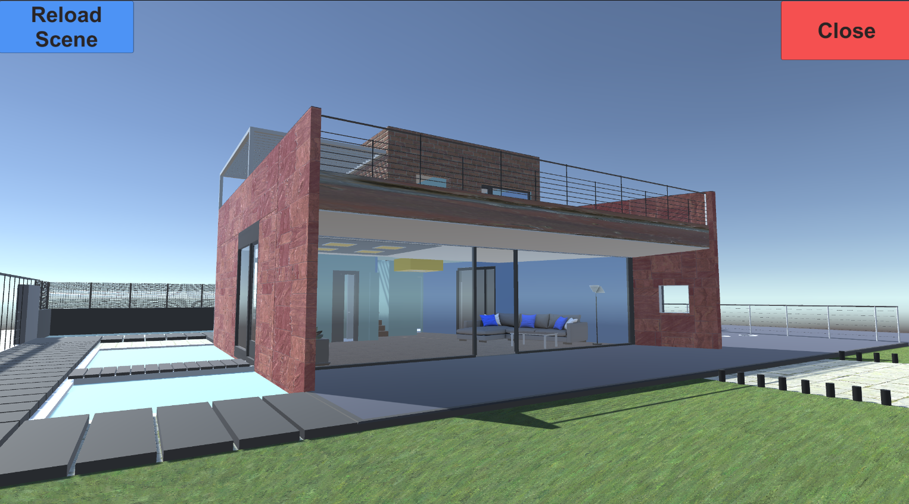
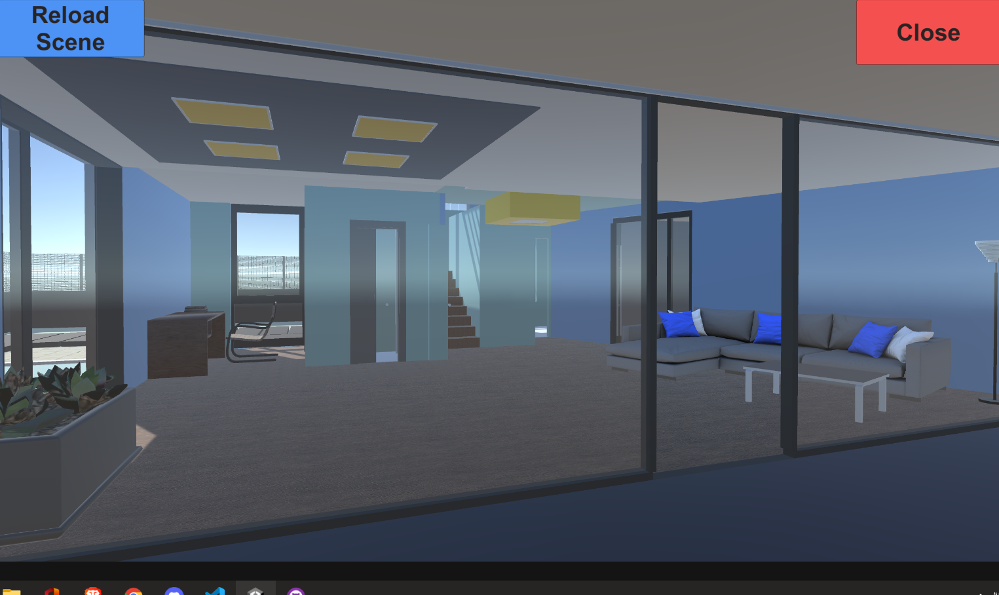

# WhiteHat_Test

<h2>Scene</h2>

The scene contains a beautiful 3D house with various textures like, Transparent Glass, Brick walls, 
Plasted Walls, Wooden Carpet, High Quality Furnitures and other props for decoration. 

<h2>Controls</h2>

 The player view or direction is controlled with the mouse. 

 The movement of the player i.e. Right, Left, Forward and Backward is controlled through the d,a,w,s keys respectively. 

<h2> Dynamic Rendering </h2>

 The objects on each floor is rendered based on the position of the player i.e. whether the player is on ground or first floor. 

# Screenshots

